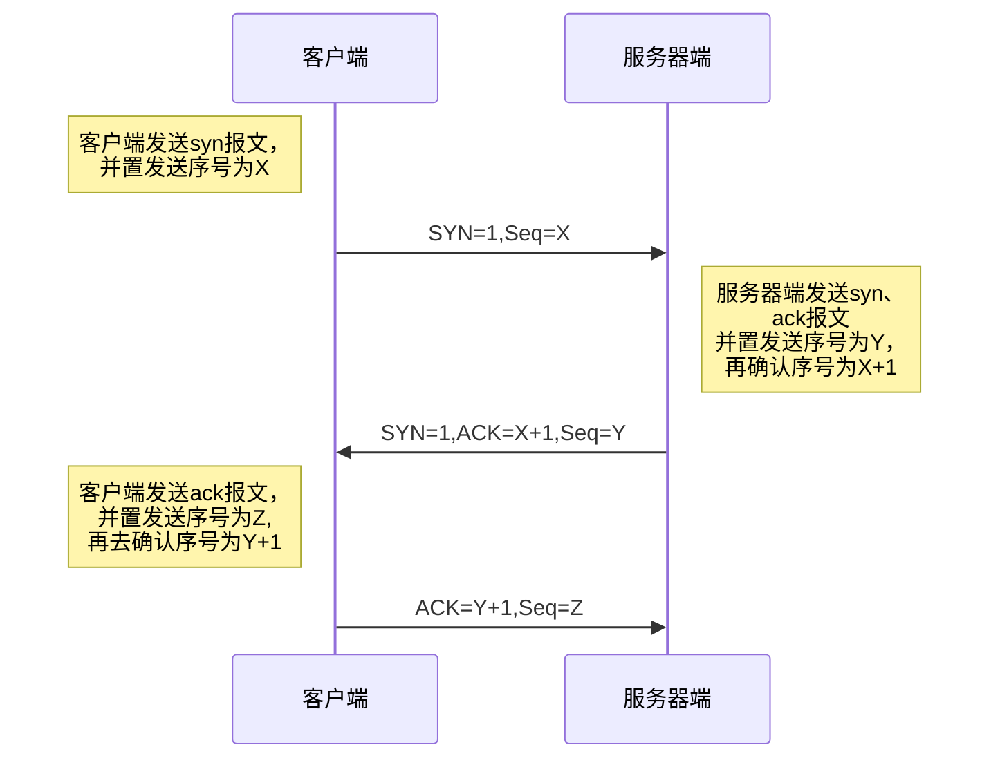
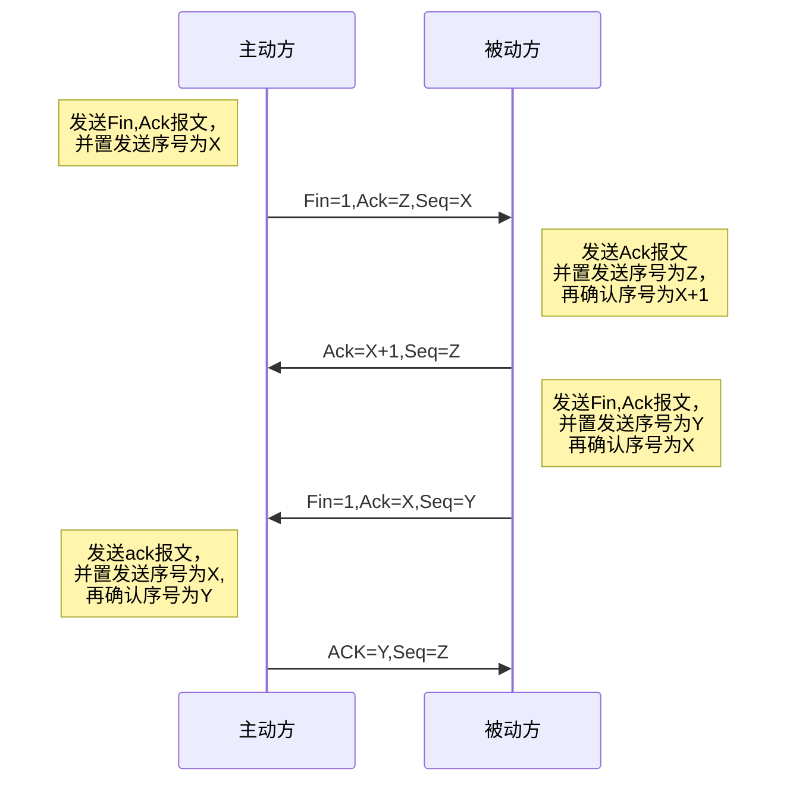

## 写在开头

**本文基本上只是复述了，知乎一篇文章，方便自己加深巩固，如果学习，可以直接看原文**

**原文地址**：https://www.zhihu.com/search?type=content&q=Tcp%20ip

## Tcp 三次握手

**三次握手原因**：为了防止已失效的连接请求报文段突然又传送到了服务端，因而产生错误。

已失效连接请求，指的是client发送的请求，在网络上滞留了长时间，本身已无意思，到达服务器端，对这种情况，如果没有最后的三次握手，服务器端把任意连接请求都直接建立连接，会造成一部分资源白白浪费掉，所以为了防止这种情况，服务器端要等待收到确认请求，是个正常连接请求，再建立连接。本质上是解决服务器端资源的考虑。

## Tcp 四次挥手

**四次挥手原因**：TCP协议是一种面向连接的、可靠的、基于字节流的运输层通信协议。TCP是全双工模式，这就意味着，当主机1发出FIN报文段时，只是表示主机1已经没有数据要发送了，主机1告诉主机2，它的数据已经全部发送完毕了；但是，这个时候主机1还是可以接受来自主机2的数据；当主机2返回ACK报文段时，表示它已经知道主机1没有数据发送了，但是主机2还是可以发送数据到主机1的；当主机2也发送了FIN报文段时，这个时候就表示主机2也没有数据要发送了，就会告诉主机1，我也没有数据要发送了，之后彼此就会愉快的中断这次TCP连接。

**等待2MSL原因**：MSL 报文段最大生存时间，它是任何保温段被丢弃钱在网络内的最大时间。

- 保证TCP协议的全双工连接能够可靠关闭
- 保证这次谅解的重复数据段从网络中完全消失，防止关闭后，还有数据到达到被动端，造成以为新连接数据包，发生混淆。

## TCP流量控制

滑动窗口机制

分为发送窗口和接收窗口，因为是全双工的，所以两方都会有这两种窗口。

建立连接后，双方分别会接收到对方接收窗口的大小。

发送窗口中的数据分为四个状态

- 已发送已Ack

- 已发送未Ack

- 待发送未Ack

- 未发送未Ack

  如果发送窗口中已发送未Ack大小已经等于对方的接收窗口容量，则不再发送新数据，依次超时重传，陆续收到ack之后再发送新数据。

  可以有效提高吞吐量以及丢包问题。

## TCP拥塞控制

发送方维持一个拥塞窗口 cwnd ( congestion window )的状态变量。拥塞窗口的大小取决于网络的拥塞程度，并且动态地在变化。发送方让自己的发送窗口等于拥塞窗口。

发送方控制拥塞窗口的原则是：只要网络没有出现拥塞，拥塞窗口就再增大一些，以便把更多的分组发送出去。但只要网络出现拥塞，拥塞窗口就减小一些，以减少注入到网络中的分组数。

**慢开始算法**：

发送数据量的大小，采用逐步增大，防止阻塞网络。

每经过一个传输轮次（往返时间RTT），拥塞窗口 cwnd 就加倍。不过“传输轮次”更加强调：把拥塞窗口cwnd所允许发送的报文段都连续发送出去，并收到了对已发送的最后一个字节的确认。

另，慢开始的“慢”并不是指cwnd的增长速率慢，而是指在TCP开始发送报文段时先设置cwnd=1，使得发送方在开始时只发送一个报文段（目的是试探一下网络的拥塞情况），然后再逐渐增大cwnd。

为了防止拥塞窗口cwnd增长过大引起网络拥塞，还需要设置一个慢开始门限ssthresh状态变量。慢开始门限ssthresh的用法如下：

- 当 cwnd < ssthresh 时，使用上述的慢开始算法。
- 当 cwnd > ssthresh 时，停止使用慢开始算法而改用拥塞避免算法。
- 当 cwnd = ssthresh 时，既可使用慢开始算法，也可使用拥塞控制避免算法。

**拥塞避免**:

让拥塞窗口cwnd缓慢地增大，即每经过个往返时间RTT发送方的拥塞窗口cwnd加1，而不是加倍。这样拥塞窗口cwnd按线性规律缓慢增长，比慢开始算法的拥塞窗口增长速率缓慢得多。

无论在慢开始阶段还是在拥塞避免阶段，只要发送方判断网络出现拥塞（其根据就是没有收到确认），就要把慢开始门限ssthresh设置为出现拥塞时的发送 方窗口值的一半（但不能小于2）。然后把拥塞窗口cwnd重新设置为1，执行慢开始算法。

这样做的目的就是要迅速减少主机发送到网络中的分组数，使得发生 拥塞的路由器有足够时间把队列中积压的分组处理完毕

